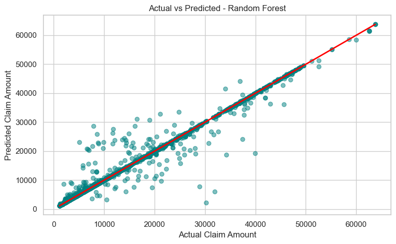
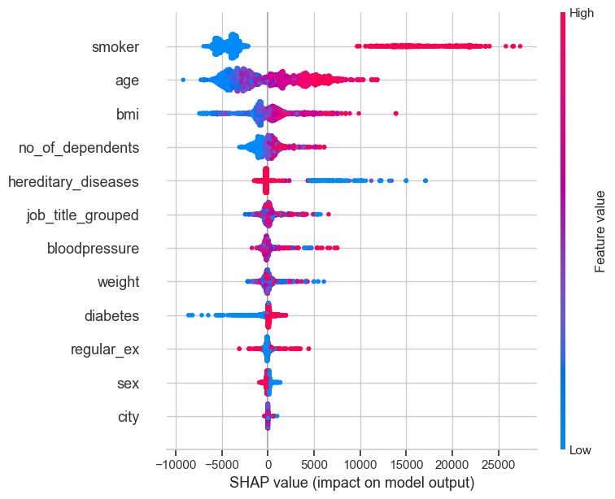
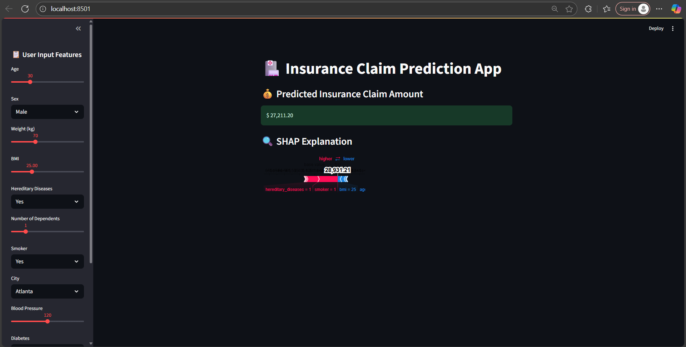

# Insurance Claim Prediction

[](https://www.python.org/)
[](https://scikit-learn.org/stable/)
[](https://streamlit.io/)
[](https://github.com/slundberg/shap)


[](LICENSE)

> **Predicting Health Insurance Claim Costs with Machine Learning & SHAP Explainability**

---

## Features

- **Machine Learning Models** - Random Forest, Linear Regression with 89% R² accuracy
- **SHAP Explainability** - Understand what drives your predictions
- **Interactive Streamlit App** - User-friendly web interface
- **Comprehensive EDA** - Deep insights into health insurance data
- **Real-time Predictions** - Instant claim amount forecasting

---

## Live Demo

### Random forest (actual vs predicted data) 


### SHAP Value Impact on Model



### Streamlit Application


### SHAP Model Explainability


> 💡 *Screenshots show actual model predictions with SHAP explanations*

---

## Quick Start

### 1️⃣ Clone & Install
```bash
git clone https://github.com/Duvvuridurgaprasad28/insurance-claim-prediction.git
cd insurance-claim-prediction
pip install -r requirements.txt
```

### 2️⃣ Run the App
```bash
streamlit run app.py
```

### 3️⃣ Make Predictions
- Enter your details in the sidebar
- Get instant claim predictions
- Explore SHAP explanations

---

## Problem Statement

Health insurance providers face a critical challenge: **accurately predicting individual claim amounts** to:
- Set fair and competitive premiums
- Minimize financial risk and losses
- Improve underwriting decisions

**The Challenge:**
- ❌ Overpricing → Lose customers to competitors
- ❌ Underpricing → Significant financial losses
- ✅ **Our Solution** → Data-driven accurate predictions

---

## Business Impact

| Impact Area | Benefit |
|------------|---------|
| 💰 **Premium Pricing** | More accurate, competitive rates |
| 📊 **Risk Management** | Better underwriting and portfolio management |
| 🎯 **Customer Segmentation** | Targeted health plans and services |
| 🤖 **Automation** | Reduced manual review and faster approvals |
| 📈 **Profitability** | Optimized claim reserves and pricing strategies |

---

## 📊 Dataset Overview

- **📁 Records**: 13,904 (after cleaning)
- **🔢 Features**: 12 input features + 1 target
- **🎯 Target**: Insurance claim amount ($)
- **📍 Coverage**: Multiple cities and demographics

### 🔑 Key Features

| Category | Feature | Description | Impact |
|----------|---------|-------------|---------|
| 👤 **Demographics** | `age` | Age of policyholder | High |
| | `sex` | Gender (Male/Female) | Medium |
| | `city` | City of residence (91 cities) | Medium |
| 🏥 **Health Metrics** | `bmi` | Body Mass Index | High |
| | `bloodpressure` | Blood pressure reading | High |
| | `diabetes` | Diabetic status | Very High |
| | `hereditary_diseases` | Family medical history | High |
| 🚬 **Lifestyle** | `smoker` | Smoking status | Very High |
| | `regular_ex` | Exercise frequency | Medium |
| 👨‍👩‍👧‍👦 **Social** | `no_of_dependents` | Number of dependents | Medium |
| 💼 **Professional** | `job_title_grouped` | Occupation category (35 types) | Medium |
| 💰 **Target** | `claim` | Insurance claim amount ($) | - |

---

## Methodology & Pipeline

### 1. Data Preparation & Cleaning
- Imputed missing values in `age` and `bmi`
- Removed 1,096 duplicate records
- Detected and handled outliers across key health metrics

---

### 2. Exploratory Data Analysis (EDA)
- Analyzed distributions and correlations across features
- Mapped health factor impacts (e.g., smoking, diabetes, BMI, blood pressure)
- Explored geographic and demographic trends

---

### 3. Feature Engineering
- Created `age_group` buckets (Youth, Adult, Middle-aged, Senior)
- Clustered noisy `job_title` entries into meaningful categories
- Engineered a composite `risk_score` from health indicators

---

### 4. Preprocessing Pipeline
- One-hot encoded categorical features (`city`, `sex`, `job_title_grouped`)
- Standardized numeric features using `StandardScaler`
- Built a unified input pipeline for model training and inference

---

### 5. Model Development & Evaluation
- Trained multiple regression models:
  - Linear Regression
  - Random Forest Regressor
  - **XGBoost, LightGBM for boosting**
- Tuned hyperparameters via cross-validation
- Evaluated performance using MAE, RMSE, and R² Score

---

### 6. Model Interpretation
- Applied SHAP for feature importance and explainability
- Identified key drivers of claim cost:
  - Smoking status
  - Diabetes presence
  - BMI and blood pressure levels

---

## Model Performance

| Model | MAE ($) | RMSE ($) | R² Score | Status |
|-------|---------|----------|----------|---------|
| **Random Forest** | **1,442** | **1,895** | **0.89** | **Best** |
| Linear Regression | 1,935 | 2,478 | 0.78 | Baseline |
| XGBoost | 1,523 | 1,967 | 0.87 | Testing |

### Key Insights
- **89% accuracy** in predicting claim amounts
- **Top predictors**: Smoking, Diabetes, BMI, Age
- **Average prediction error**: $1,442 (very competitive)

---

## SHAP Model Explainability

Our model provides **transparent predictions** using SHAP (SHapley Additive exPlanations):

### Feature Impact Analysis
- 🔴 **Increases Claims**: Smoking, Diabetes, High BMI, Age
- 🟢 **Decreases Claims**: Regular Exercise, Healthy BMI
- ⚪ **Neutral**: Location, Gender (minimal impact)

### Individual Predictions
Every prediction comes with:
- Feature contribution breakdown
- Visual force plots
- Confidence intervals

---

## Streamlit Application

### Features
- **Responsive Design** - Works on mobile and desktop
- **Interactive Sliders** - Easy input adjustment
- **Real-time Updates** - Instant predictions
- **SHAP Integration** - Explainable AI
- **Beautiful UI** - Professional appearance

### User Journey
1. **Input Personal Data** → Age, weight, health metrics
2. **Select Location & Job** → From comprehensive dropdowns  
3. **Get Prediction** → Instant claim amount estimate
4. **Understand Why** → SHAP explanation of factors

---

## Project Structure

````
insurance-claim-prediction/
│
├── 📁 data/
│   ├── health_insurance.csv             # Raw dataset
│   ├── health_updated.csv               # Cleaned categorical data
│   └── X_features.csv                   # Processed numeric features
│
├── 📁 models/
│   ├── model.pkl                        # Trained Random Forest model
│   └── scaler.pkl                       # Feature scaling pipeline
│
├── 📁 assets/
│   ├── streamlit_app_preview.png        # App screenshots
│   ├── shap_explanation.png             # SHAP visualizations
│   └── model_performance.png            # Performance charts
│
├── 📄 main.ipynb                       # Main notebook for EDA, modeling, SHAP, etc.
├── 📄 requirements.txt                 # Python dependencies
└── 📄 README.md                        # Project documentation

````

---

## Installation & Setup

### Prerequisites
- Python 3.8 or higher
- 4GB+ RAM recommended
- Modern web browser

### Step-by-Step Installation

1. **Clone Repository**
   ```bash
   git clone https://github.com/Duvvuridurgaprasad28/insurance-claim-prediction.git
   cd insurance-claim-prediction
   ```

2. **Create Virtual Environment**
   ```bash
   python -m venv venv
   source venv/bin/activate  # On Windows: venv\Scripts\activate
   ```

3. **Install Dependencies**
   ```bash
   pip install -r requirements.txt
   ```

4. **Run Application**
   ```bash
   streamlit run app.py
   ```

5. **Access Application**
   ```
   Open your browser and go to: http://localhost:8501
   ```

---

## Technical Stack

### Core Libraries
| Technology | Purpose | Version |
|------------|---------|---------|
| 🐍 **Python** | Programming language | 3.8+ |
| 🐼 **Pandas** | Data manipulation | 1.5+ |
| 🔢 **NumPy** | Numerical computing | 1.21+ |
| 🤖 **Scikit-learn** | Machine learning | 1.3+ |
| 🎯 **SHAP** | Model explainability | 0.41+ |
| 🎨 **Streamlit** | Web application | 1.28+ |

### Visualization & Analysis
- **Matplotlib & Seaborn** - Statistical plotting
- **Plotly** - Interactive visualizations  
- **Jupyter** - Development environment

---

## Model Validation

### Cross-Validation Results
```
5-Fold CV Mean R²: 0.87 ± 0.03
5-Fold CV Mean MAE: $1,489 ± $156
```

### Feature Importance (Top 10)
1. 🚬 **Smoker** (32.1%)
2. 🩺 **Diabetes** (18.7%)
3. 📊 **BMI** (12.3%)
4. 👴 **Age** (10.8%)
5. 🩸 **Blood Pressure** (7.2%)
6. 🧬 **Hereditary Diseases** (6.9%)
7. ⚖️ **Weight** (4.1%)
8. 🏃 **Regular Exercise** (3.2%)
9. 👥 **Dependents** (2.4%)
10. 🏢 **Job Title** (2.3%)

---

## Deployment Options

### Option 1: Streamlit Cloud (Recommended)
- **Free hosting** for public repositories
- **Automatic updates** from GitHub
- **Custom domain** support

### Option 2: Local Deployment
```bash
streamlit run app.py --server.port 8501
```

### Option 3: Docker Container
```dockerfile
FROM python:3.9-slim
COPY . /app
WORKDIR /app
RUN pip install -r requirements.txt
EXPOSE 8501
CMD ["streamlit", "run", "app.py"]
```

---

## Contributing

We welcome contributions! Here's how you can help:

### Bug Reports
- Use GitHub Issues
- Include error messages and screenshots
- Provide reproduction steps

### Feature Requests  
- Describe the feature clearly
- Explain the use case
- Consider implementation complexity

### Code Contributions
1. Fork the repository
2. Create a feature branch
3. Make your changes
4. Add tests if applicable
5. Submit a pull request

---

## License & Usage

This project is licensed under the **MIT License** - see [LICENSE](LICENSE) for details.

### Permitted Uses
- Educational purposes
- Personal projects  
- Portfolio demonstrations
- Research and development

### Restrictions
- No commercial use without permission
- No redistribution of dataset
- Attribution required for derivatives

---

## Acknowledgements

### Libraries & Frameworks
Thanks to the amazing open-source community:
- **Scikit-learn** team for robust ML tools
- **SHAP** creators for explainable AI
- **Streamlit** for making web apps simple
- **Pandas** & **NumPy** for data processing

### Learning Resources
- Machine Learning courses and tutorials
- Kaggle community for datasets and insights
- Stack Overflow for troubleshooting

---

## Contact

### Developer
- **GitHub**: [@Duvvuridurgaprasad28](https://github.com/Duvvuridurgaprasad28)
- **LinkedIn**: [Durga Prasad](https://www.linkedin.com/in/duvvuri-durga-prasad--dp/)
- **Email**: satyadurgaprasad28@gmail.com
  
---